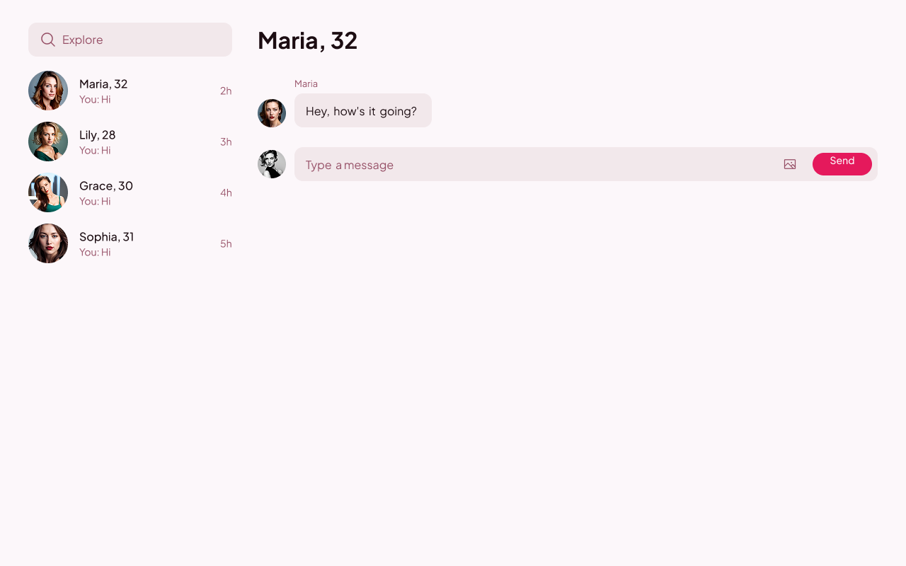
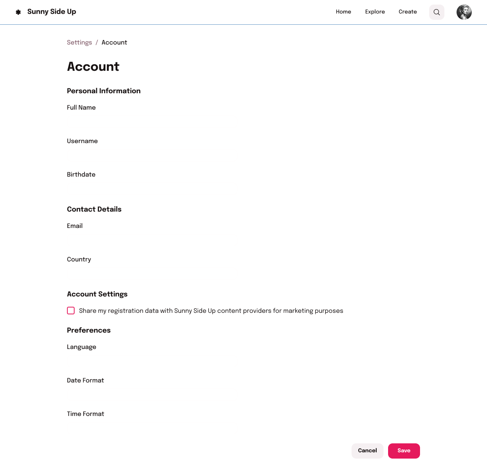

# Matcha-42

The web project from School 42 is a dating website where the user can create a profile, search for other users, like them, and begin a conversation if the person you like likes you back.

# Stack

- Frontend: Nextjs15, React19, Tanstack Query, Tailwind Css, ShadCn, Zod, React Hook Form
- Backend: Express Js, Postgresql (No ORM), Cloudinary for picture storage.

# Showcase

